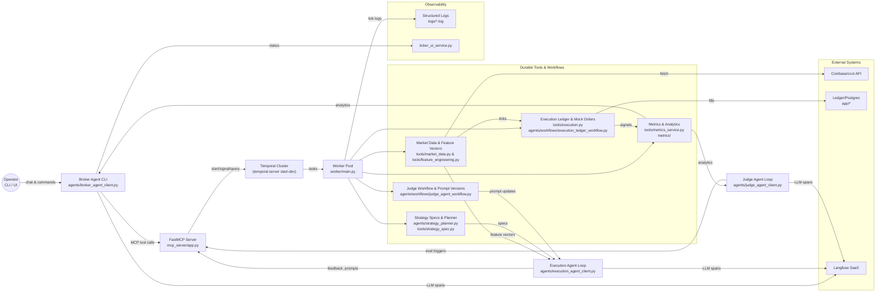
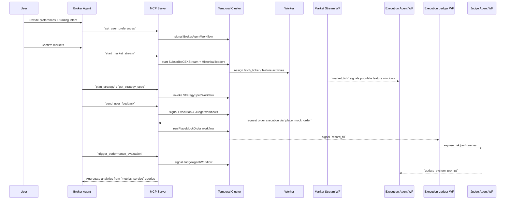
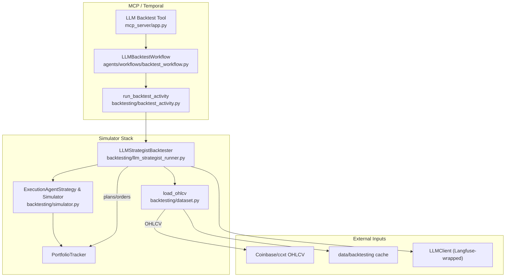

# Durable Trading Stack Architecture

This document captures how the repository’s major surfaces connect to deliver a durable, multi-agent crypto trading stack. The codebase wraps Model Context Protocol (MCP) tools around Temporal workflows so every LLM-driven agent call translates into deterministic, replayable activity.

## Repository Surfaces

| Location | Purpose | Key Connections |
| --- | --- | --- |
| `agents/` | LLM-driven broker, execution, and judge agents plus shared utilities (logging, Langfuse instrumentation, prompt templates). | Agents call MCP tools exposed by the server and share state via Temporal workflows such as `BrokerAgentWorkflow` and `ExecutionLedgerWorkflow`. |
| `tools/` | Durable MCP tools implemented as Temporal workflows/activities (market data, execution, metrics, strategy specs, wallet ops). | Imported by the worker and MCP server; interact with exchanges via `ccxt`, ledger DB activities, and the metrics package. |
| `workflows/` & `agents/workflows/` | Workflow definitions for agents, ledger, strategy storage, backtests, and ensembles. | Registered automatically by `worker/main.py`; invoked through tool calls or inter-workflow signals. |
| `mcp_server/` | FastAPI/fastmcp server converting HTTP MCP requests into Temporal workflow executions, queries, and signals. | Acts as the control plane for agents (`agents/*_client.py`), ticker UI, and any MCP-compatible client. |
| `worker/` | Temporal worker bootstrap that discovers all workflows/activities in `agents/`, `tools/`, and `workflows/`. | Connects to the Temporal cluster (`TEMPORAL_ADDRESS`) and executes tasks from the `mcp-tools` queue. |
| `app/`, `services/`, `trading_core/` | Supporting services: ledger database models, dashboards, indicator engines, planner services, and backtesting utilities used by activities. | Activities such as `agents.activities.ledger.persist_fill_activity` depend on these modules for persistence and analytics. |
| `metrics/` | Feature library plus helpers for technical indicators exposed via MCP tools. | Used by `tools/metrics_service.py` and judge/broker agents when answering analytics requests. |
| `run_stack.sh`, `docker-compose.yml` | Local orchestration that brings up Temporal dev server, worker, MCP server, three agent clients, and the terminal ticker UI in tmux panes. | Ensures every service shares env vars (e.g., `INITIAL_PORTFOLIO_BALANCE`) and routes traffic through MCP + Temporal. |
| `tests/` | Pytest suite mirroring the module layout for workflows, tools, and analytics helpers. | Validates deterministic behavior of workflows and contract tests for tools. |

## System Context



**Flow summary**

1. The broker agent is the single human-facing interface. Every command is routed through the MCP server and executed as a Temporal workflow, giving deterministic audit logs.
2. The execution agent consumes feature vectors, user nudges, and judge-issued prompt updates to turn model intent into order intents, which are replayable via `ExecutionLedgerWorkflow`.
3. The judge agent scores performance, mutates prompts via `JudgeAgentWorkflow`, and can trigger evaluations or prompt rollbacks.
4. Durable tools interact with Coinbase through `ccxt`, store ledger entries in Postgres via `persist_fill_activity`, and cache analytics in `metrics/`.
5. Observability is centralized through `agents.logging_utils`, Langfuse traces (`agents/langfuse_utils.py`), and optional terminal UI visualizations.

## Durable Agent Control Flow



## Component Responsibilities

| Layer | Description | Interfaces |
| --- | --- | --- |
| **User Interfaces** | `agents/broker_agent_client.py` (primary CLI), `ticker_ui_service.py` (market visualizer). Solicit risk profiles, translate chat to tool calls. | MCP over HTTP, structured logs, Langfuse spans. |
| **LLM Agents** | Broker, execution, and judge clients share utility modules (`agents/context_manager.py`, `agents/prompt_manager.py`). Execution focuses on action gating and risk; judge manages evaluations and prompt versions. | MCP tools (start streams, ledger queries, prompt updates), Temporal queries. |
| **MCP Server** | `mcp_server/app.py` registers every tool, handles HTTP requests (`@app.tool`), and proxies to Temporal workflows/signals/queries. Maintains lightweight signal log for UI clients. | Temporal gRPC client (`agents.temporal_utils.get_temporal_client`), HTTP endpoints for signal taps. |
| **Temporal Worker** | `worker/main.py` auto-discovers modules, registers workflows/activities, and runs them on `mcp-tools` queue with optional UnsandboxedWorkflowRunner. | Temporal namespace (`TEMPORAL_NAMESPACE`), thread pool for blocking activities (e.g., ledger persistence). |
| **Durable Tools** | Modules in `tools/` encapsulate specific responsibilities: market data ingestion (`tools/market_data.py`), feature computation (`tools/feature_engineering.py`), execution + ledger coordination (`tools/execution.py`, `agents/workflows/execution_ledger_workflow.py`), metrics (`tools/metrics_service.py`), prompts/logging (`tools/agent_logger.py`), strategy lifecycle (`tools/strategy_spec.py`). | Activities call external APIs (Coinbase via `ccxt`), file cache (`data/market_cache`), internal services in `app/` and `services/`. |
| **Supporting Services** | `app/` hosts SQLAlchemy models, ledger engines, dashboard APIs, Coinbase integrations. `services/` adds specialized workers (signal agent, market data worker). They power Temporal activities without exposing direct MCP tools. | Database connections, Coinbase credentials, caching layers. |
| **Observability & Governance** | `agents/logging_utils.py` enforces colorized structured logging. `agents/langfuse_utils.py` wraps OpenAI clients so every LLM call emits Langfuse spans. Logs live under `logs/`. Tests under `tests/` keep workflows deterministic. | Langfuse API, local filesystem for logs/artifacts. |

## Data & State Flows

1. **Market data** &rarr; `tools/market_data.SubscribeCEXStream` fetches ticks via `ccxt`, records them for UI consumers, and signals `ComputeFeatureVector` workflows. Historical data is preloaded by `HistoricalDataLoaderWorkflow`.
2. **Feature vectors to execution** &rarr; Execution agent queries feature workflows for price freshness, combines user preferences (`set_user_preferences` signals) and strategy specs for decision gating (`ExecutionAgentState`).
3. **Order intents to ledger** &rarr; `tools/execution.PlaceMockOrder` (or batch) returns synthetic fills and signals `ExecutionLedgerWorkflow`, which updates balances, calculates realized PnL, applies profit scraping, and asynchronously runs `persist_fill_activity` into the double-entry ledger database.
4. **Strategy lifecycle** &rarr; `agents/strategy_planner.py` uses OpenAI (via Langfuse-instrumented client) to produce JSON specs stored durably in `StrategySpecWorkflow`. MCP tools expose `get_strategy_spec`, `list_strategy_specs`, and updates feed execution gating decisions.
5. **Judge loop** &rarr; `JudgeAgentWorkflow` records evaluations, prompt versions, and contextual state. The judge client reads ledger + metrics queries to score execution, emit recommendations, and roll prompts forward/backward. Judge integration is preserved across live runs, unit tests, and backtests so prompt updates, evaluation triggers, and user feedback are exercised end-to-end instead of mocked.
6. **Analytics** &rarr; `tools/metrics_service.py` fetches OHLCV, caches it under `data/market_cache`, validates columns, and pipes calculations from `metrics/`. Agents and dashboards hit MCP tools like `compute_technical_metrics` to answer user questions.

## Testing & Deterministic Assurance

- **Pytest matrix**: `uv run pytest [-k pattern]` executes suites under `tests/`, mirroring module paths (e.g., workflow tests live next to `agents/workflows`, market tools are validated near `tools/`). These tests assert Temporal workflows remain deterministic, that MCP tool schemas match the expectations encoded in clients, and that analytics helpers (`metrics/`, `tools/metrics_service.py`) return stable outputs for fixed fixtures.
- **Temporal-focused tests**: Workflows like `ExecutionLedgerWorkflow`, `BrokerAgentWorkflow`, `JudgeAgentWorkflow`, and `LLMBacktestWorkflow` receive targeted tests to ensure signal/query handling, continuation-as-new logic, and ledger math can be replayed across runs.
- **Activity/DAO tests**: Modules under `app/` and `agents/activities/ledger.py` are exercised with database fixtures to verify that the double-entry ledger postings match each fill event.
- **Contracts for MCP tools**: Tests confirm that `mcp_server/app.py` exposes each tool with correct schemas and that the worker (`worker/main.py`) discovers every annotated workflow/activity. This guards the **Repository Surfaces** table entries for `mcp_server/`, `tools/`, and `workflows/`.
- **Judge parity**: Judge client workflows and CLI loops (`agents/judge_agent_client.py`) are wired into the same MCP interactions the live system uses, so regression suites cover prompt rollbacks, user feedback propagation, and evaluation triggers without relying on stubs.
- **Observability verification**: Logging utilities (`agents/logging_utils.py`) and Langfuse instrumentation (`agents/langfuse_utils.py`) include smoke tests to ensure spans/logs attach to every agent call path outlined in the **System Context** section.

## Backtesting Architecture

Backtests reuse the same durable primitives highlighted earlier while adding simulators and Temporal activities in `backtesting/` and `agents/workflows/backtest_workflow.py`.


Backtests reuse the same durable primitives highlighted earlier while adding simulators and Temporal activities in `backtesting/` and `agents/workflows/backtest_workflow.py`. Broker, execution, and judge agents operate with full fidelity: strategist runs still emit prompt/feedback updates, Judge workflows can be signaled for interim reports, and analytics queries hit the same MCP tools that power production evaluations.

### Data Stepping Strategy

1. **Dataset hydration**: `backtesting/dataset.load_ohlcv` streams OHLCV bars from Coinbase via `ccxt`, normalizes timestamps, and caches CSVs under `data/backtesting`. When tests/backtests request overlapping windows, cached slices are reused for deterministic runs.
2. **Feature computation**: `backtesting/simulator._compute_features` and similar helpers create rolling highs/lows, ATR, and volume multiples, mirroring the live feature engineering (`tools/feature_engineering.py`). This ensures Execution Agent strategies observe the same feature schema in both production and tests.
3. **Intent evaluation loop**: `ExecutionAgentStrategy.decide` (from `backtesting/strategies.py`) consumes each feature vector chronologically. `_apply_intents` enforces cash/position constraints and simulates fee debits with configurable rates so tests can assert ledger-equivalent balances.
4. **Portfolio tracking**: `PortfolioTracker` mirrors `ExecutionLedgerWorkflow` concepts by tracking cash, mark-to-market equity, fills, and realized PnL. Its snapshots feed `tools/performance_analysis.PerformanceAnalyzer` for Sharpe, drawdown, and win-rate statistics.
5. **LLM strategist runs**: `LLMStrategistBacktester` coordinates `StrategyPlanProvider`, `RiskEngine`, `TriggerEngine`, and judge-facing analytics from `trading_core.judge_agent` to step through multi-timeframe candles. Plans are compiled via `trading_core.trigger_compiler`, executed against historical bars, and routed through the same evaluation/prompts pipeline so Judge workflows can score them. `llm_calls_per_day` caps match production guardrails.
6. **Temporal orchestration**: `LLMBacktestWorkflow` wraps the activity so backtests can run inside the same Temporal namespace, benefiting from retries, visibility, and history replay. This aligns with the **Durable Tools & Workflows** nodes shown in the **System Context** diagram.

### Testing & Backtesting Coverage Map

| Architectural Area | Active During Tests/Backtests | Notes |
| --- | --- | --- |
| `tools/market_data.py`, `tools/feature_engineering.py` | ✅ Feature windows and market tick handling are mirrored in simulator feature builders to validate execution logic against canned data. |
| `agents/workflows/execution_ledger_workflow.py` | ✅ PortfolioTracker + `_apply_intents` simulate the same cash/position math, enabling ledger regression tests and comparisons between live and simulated fills. |
| `mcp_server/app.py`, `worker/main.py` | ✅ Backtest tools register through the same MCP/Temporal discovery path, so CLI-triggered backtests exercise the routing described in **System Context**. |
| `agents/strategy_planner.py`, `agents/strategies/*` | ✅ LLM-driven plans are cached and replayed inside the strategist runner, ensuring tests cover both prompt generation and deterministic execution of compiled plans. |
| `metrics/`, `tools/metrics_service.py` | ✅ Performance summaries in backtests rely on identical metric functions, so analytics behavior tested here automatically applies to live dashboards and judge scorecards. |
| `agents/workflows/judge_agent_workflow.py`, `agents/judge_agent_client.py` | ✅ Prompt versioning, evaluation triggers, and context rollbacks are exercised through the same MCP pathways, keeping judge behavior identical between simulations and production. |
| `tests/` | ✅ Houses workflow, tool, and analytics tests that assert the behavior documented in **Repository Surfaces** remains stable. |

By reusing the same components across production agents, tests, and backtests, the team can step through historical data with high fidelity, assert deterministic behavior before enabling a strategy live, and trace every LLM-assisted decision via Langfuse spans captured both in simulation and real-time runs.

## Operations & Extensibility

- **Local stack**: `uv run ./run_stack.sh` launches Temporal dev server, worker, MCP server, all three agents, and the ticker UI in tmux panes. Logs are cleared on startup to keep audit trails tidy under `logs/`.
- **Configuration**: Secrets and environment variables live in `.env`; update `.env.example` whenever new MCP tools or services require configuration.
- **Testing**: `uv run pytest` exercises workflows, tools, and services. When extending Temporal workflows or adding MCP tools, add deterministic tests under `tests/` mirroring the module path.
- **Adding tools**: Implement the workflow/activity combo inside `tools/`, import it in `mcp_server/app.py`, and the worker auto-discovers it. Remember to wrap new LLM calls with `agents.langfuse_utils.create_openai_client`.
- **Observability**: Unexpected fallbacks or degraded modes should be logged via `setup_logging()` and surfaced to the broker/judge via MCP signals so downstream operators can react.

## Risk Controls & Diagnostics

- **Risk knobs**: Every `StrategyRun` carries `risk_limits` (max per-trade risk, per-symbol exposure, portfolio exposure, daily loss). Judge feedback can scale these limits temporarily via `risk_adjustments`, mirroring how real desks taper risk after drawdowns.
- **Backtester telemetry**: `LLMStrategistBacktester` writes `limit_enforcement` entries for each simulated day that now include:
  - `trades_blocked_by_*` counters for every constraint dimension (daily caps, symbol vetoes, direction/category vetos, plan errors, missing indicators, risk caps, etc.).
  - `risk_block_breakdown` showing how often each risk parameter (e.g., `max_symbol_exposure_pct`) prevented sizing.
  - `blocked_details`, a per-trade log with timestamps, symbols, sides, and human-readable detail strings (“Reached max trades per day (5)”, “Risk constraint max_symbol_exposure_pct prevented sizing”).
  - `risk_limit_hints`, which count trades that would have neared the configured limits even when they executed.
- **Judge feedback loop**: Daily reports surface the judge’s structured feedback plus the current `risk_adjustments` snapshot so the LLM strategist and human operators can see when risk was throttled, why, and what criteria will restore the original settings.
- **Configurable backtests**: `backtesting/cli.py` can ingest risk overrides via `--risk-config path/to.json` plus CLI flags (`--max-position-risk-pct`, etc.), making it easy to replicate risk officer tweaks in historical simulations. A sample config lives at `configs/risk_limits.example.json`; run it with:
  ```
  uv run python backtesting/cli.py \
    --pair BTC-USD \
    --start 2024-01-01 \
    --end 2024-02-01 \
    --llm-strategist enabled \
    --risk-config configs/risk_limits.example.json
  ```
  You can still override individual keys on the CLI (e.g., `--max-position-risk-pct 0.75`) to test alternate guardrails without editing the file.
- **Unified risk enforcement**: `TradeRiskEvaluator` funnels every trigger category through the same sizing/risk gate so trend, mean-reversion, reversal, and breakout entries all respect position and exposure limits. Emergency exits always pass through the helper but may bypass daily caps inside `ExecutionEngine` so that protective “flatten” actions execute instantly even if other constraints (daily trades, symbol vetoes) would normally block them.

This layered architecture lets the team evolve agents, tools, or analytics independently while guaranteeing every high-level action flows through Temporal for replayability and through Langfuse/logs for auditability.
