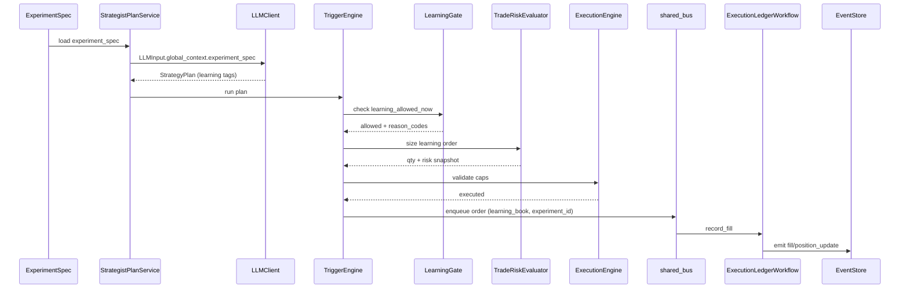
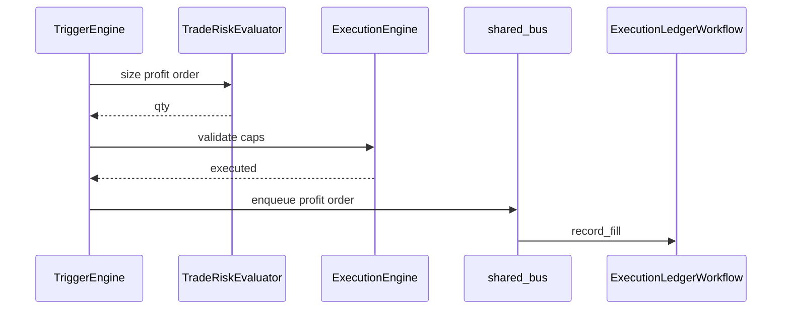
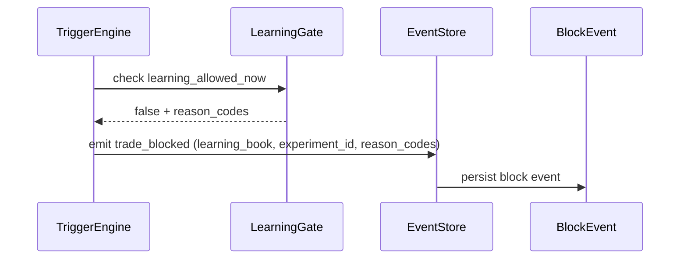

# Runbook: Architecture Wiring

## Overview
- Objective: map Learning Book + ExperimentSpec + no-learn zones into the existing crypto bot stack with explicit integration points.
- Scope: wiring and tag propagation only; no new strategy logic beyond experiments.

## Why it exists
Documentation without wiring causes drift between backtests and live execution. This runbook connects the Learning Book system to specific modules, data models, and event pipelines already in the repo.

## Definitions
- Learning Book: exploration-only trade stream with its own risk budgets and tags.
- ExperimentSpec: the schema that binds question -> exposure -> metrics.
- Tag propagation: `learning_book` + `experiment_id` must survive from signal to DB.

## Interfaces & Contracts
### Tag propagation contract
All stages MUST carry `learning_book` (bool) and `experiment_id` (string, required for learning). Propagation path:
- Signal: `schemas/llm_strategist.py` (TriggerCondition).
- Order: `agents/strategies/trigger_engine.py` (Order dataclass).
- Execution events: `agents/event_emitter.py` payloads for `order_submitted`, `fill`, `position_update`, `trade_blocked`.
- Persistence: `app/db/models.py` columns on `orders`, `position_snapshots`, `risk_allocations`, `block_events`.
- Ops API: `ops_api/schemas.py` (FillRecord) and `ops_api/materializer.py` read models.

### CLI/config entry points to add
- `backtesting/cli.py`: add `--learning-book-enabled`, `--experiment-id`, `--experiment-spec-path`, `--learning-daily-risk-budget-pct`.
- `ops_api/routers/backtests.py`: add `learning_book_enabled`, `experiment_id`, `experiment_spec` fields to BacktestConfig.
- `ops_api/routers/paper_trading.py`: add `learning_book_enabled`, `experiment_id`, `experiment_spec` to PaperTradingSessionConfig.
- `services/strategy_run_registry.py`: accept and persist `LearningBookSettings` in StrategyRunConfig.

## Implementation Notes
### Integration points (exact file paths)
- Trigger engine / strategy selection:
  - `services/strategist_plan_service.py`
  - `agents/strategies/plan_provider.py`
  - `trading_core/trigger_compiler.py`
  - `agents/strategies/trigger_engine.py`
- Risk manager / sizing:
  - `agents/strategies/risk_engine.py`
  - `agents/strategies/trade_risk.py`
  - `schemas/strategy_run.py`
- Order router / exchange adapter:
  - `agents/shared_bus.py`
  - `services/execution_agent_service.py`
- Position store & PnL:
  - `agents/workflows/execution_ledger_workflow.py`
  - `ops_api/materializer.py`
  - `app/db/models.py`
- Backtest runner:
  - `backtesting/llm_strategist_runner.py`
  - `backtesting/simulator.py`
  - `backtesting/reports.py`
- Persistence:
  - `services/strategy_run_registry.py`
  - `app/db/migrations/`
- Telemetry:
  - `agents/event_emitter.py`
  - `ops_api/event_store.py`
  - `ops_api/schemas.py`

### Minimal migration notes + rollback
DB schema changes (alembic in `app/db/migrations/`):
- Add `learning_book` (bool) and `experiment_id` (string) to `orders`, `position_snapshots`, `risk_allocations`, `block_events`.
- Add `experiment_specs` table (spec_json, status, created_at, updated_at).
- Add `experiment_runs` table (experiment_id, run_id, plan_id, started_at, ended_at).

Rollback strategy:
- Provide a down migration that drops new columns and tables.
- Leave event-store records intact; they are append-only and safe to keep.

## Telemetry
- Event payloads MUST include `learning_book` + `experiment_id` when applicable.
- Add event types in `ops_api/schemas.py` for `experiment_created`, `experiment_status_changed`, `learning_gate_update`.
- Dashboards SHOULD group fill counts and PnL by `learning_book` and `experiment_id`.

## Checklists
### Acceptance checklist
- Learning tags propagate from signal -> order -> fill -> position -> DB.
- Learning block reasons appear in `trade_blocked` events with `reason_codes`.
- Profit trades are unaffected when learning is disabled.
- Backtest and live event payloads match for learning tags.

### Smoke test procedure
1. Create a draft ExperimentSpec and store it (DB or event store).
2. Enable `learning_book_enabled` and start a paper session.
3. Confirm a learning order emits `order_submitted` with `learning_book=true` and `experiment_id`.
4. Trigger a no-learn zone and confirm `trade_blocked` event includes reason codes.
5. Run a backtest and confirm learning PnL is separated in the report.

## Examples
Learning trade from ExperimentSpec:

Profit trade unaffected by learning system:

Learning blocked by no-learn zone + reason propagation:

